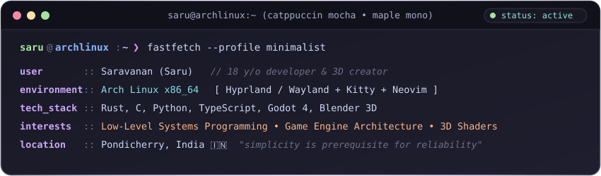
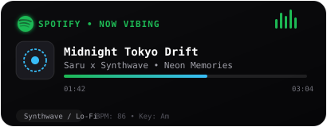
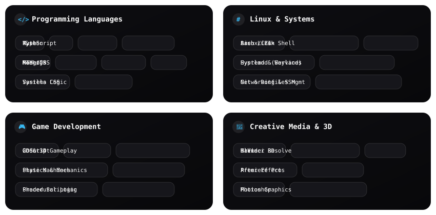

<div align="center">

  <!-- ================= HEADER BANNER ================= -->
  <a href="https://github.com/saru2406">
    <picture>
      <source media="(prefers-color-scheme: dark)" srcset="./profile-assets/banner.svg">
      <source media="(prefers-color-scheme: light)" srcset="./profile-assets/banner.svg">
      
    </picture>
  </a>

  <br/><br/>

  <!-- ================= ANIMATED TYPING SVG ================= -->
  <a href="https://github.com/saru2406">
    
  </a>

  <p align="center">
    <strong>Obsidian Dark • Pure AMOLED Minimalism • Low-Level Engineering • 3D &amp; Game Art</strong>
  </p>

  <!-- ================= SOCIAL & QUICK LINKS BADGES ================= -->
  <p align="center">
    <a href="https://github.com/saru2406">
      
    </a>
    <a href="https://linkedin.com/in/saru24">
      
    </a>
    <a href="https://www.youtube.com/@saru24">
      
    </a>
    <a href="https://www.instagram.com/saru.cloudy/">
      
    </a>
    <a href="mailto:saruxcloudy@gmail.com">
      
    </a>
    <a href="https://docs.google.com/document/d/10B1pUB6peqvw3quOgUnMJkn5jyU7WiRH9uQ2sQ-ymRQ/edit?usp=sharing">
      
    </a>
  </p>

</div>

---

### ✦ About Me

```rust
struct Developer {
    name: &'static str,
    age: u8,
    location: &'static str,
    passions: [&'static str; 4],
    current_os: &'static str,
    status: &'static str,
}

fn get_saru() -> Developer {
    Developer {
        name: "Saru (Saravanan)",
        age: 18,
        location: "Pondicherry, India",
        passions: ["Systems Programming", "Linux Internals", "Blender 3D", "Godot 4 Game Dev"],
        current_os: "Arch Linux (Hyprland / Wayland)",
        status: "Crafting performant code and immersive audiovisual experiences",
    }
}
```

> "I'm currently an 18-year-old student and developer exploring Linux and systems programming with Rust, alongside 2D/3D art in Blender, video production, and game development with Godot Engine."

---

### ✦ System Terminal &amp; Audio Environment

<div align="center">
  <table>
    <tr>
      <td width="50%" align="center" style="background-color: #08080a; border: 1px solid #222226; border-radius: 16px; padding: 12px;">
        
      </td>
      <td width="50%" align="center" style="background-color: #08080a; border: 1px solid #222226; border-radius: 16px; padding: 12px;">
        
      </td>
    </tr>
  </table>
</div>

---

### ✦ Tech Stack &amp; Creative Suite

<div align="center">
  
</div>

<br/>

<div align="center">

| Domain | Technologies &amp; Tools |
| :--- | :--- |
| **Languages** | `Rust` `C` `Python` `TypeScript` `JavaScript` `GDScript` `Bash` `Zsh` |
| **Systems &amp; DevOps** | `Arch Linux` `Hyprland (Wayland)` `Systemd` `Git` `SSH` `Networking` `Dotfiles` |
| **Game Development** | `Godot Engine 4` `2D/3D Physics` `Gameplay Architecture` `Custom Shaders` |
| **Creative &amp; VFX** | `Blender 3D` `DaVinci Resolve` `Adobe Premiere Pro` `After Effects` `Photoshop` `Krita` |
| **Web &amp; Backend** | `React` `Node.js` `TailwindCSS` `MongoDB` `Vite` `REST APIs` |

</div>

---

### ✦ GitHub Activity &amp; Live Stats

<div align="center">

  <!-- GitHub Readme Stats (Obsidian AMOLED Custom Palette) -->
  
  &nbsp;
  <!-- GitHub Top Languages -->
  

  <br/><br/>

  <!-- Streak Stats in AMOLED Obsidian Dark -->
  

</div>

---

### ✦ Deep Dive &amp; Hardware Setup

<details>
  <summary><strong>🖥️ Workspace &amp; Operating Environment</strong></summary>
  <br/>

  - **Operating System:** Arch Linux x86_64
  - **Compositor &amp; WM:** Hyprland on Wayland (Butter-smooth tiling, custom keybinds &amp; animations)
  - **Terminal / Shell:** Kitty / Alacritty + Zsh + Starship Prompt
  - **Code Editors:** Neovim (Lua configs, tailored LSP) &amp; VS Code (Obsidian pitch-black theme)
  - **Version Control:** Git with automated GPG signing &amp; dotfiles repository
</details>

<details>
  <summary><strong>🎬 3D Art &amp; Video Production Pipeline</strong></summary>
  <br/>

  - **Modeling &amp; Sculpting:** Blender 3D (Hard-surface modeling, procedural shaders, lighting)
  - **Video Editing &amp; Grading:** DaVinci Resolve Studio &amp; Adobe Premiere Pro
  - **Motion Graphics:** Adobe After Effects &amp; Blender Geometry Nodes
  - **2D Concept &amp; Texturing:** Krita, Adobe Photoshop
</details>

<details>
  <summary><strong>🎮 Game Architecture &amp; Engines</strong></summary>
  <br/>

  - **Engine:** Godot Engine 4 (Vulkan rendering backend)
  - **Core Paradigms:** State Machines, Component-based architectures, procedural level generation
  - **Audio &amp; Ambience:** Synthwave / Lo-Fi soundscapes, custom interactive SFX
</details>

---

### ✦ Contribution Snake

<div align="center">
  
</div>

---

<div align="center">

  <p>
    <i>"Simplicity is prerequisite for reliability." — Edsger W. Dijkstra</i>
  </p>

  <p>
    <a href="https://github.com/saru2406">
      
    </a>
  </p>

  <sub>Crafted with pure AMOLED Obsidian minimalism • © 2026 Saru</sub>

</div>
